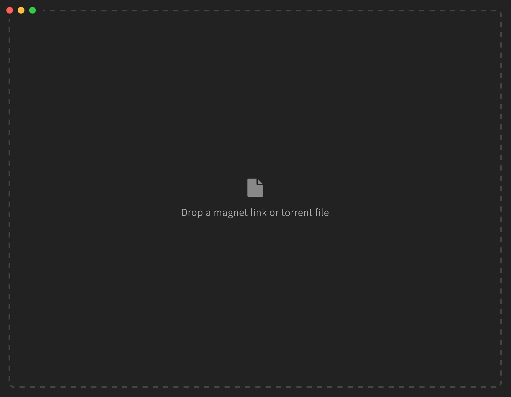
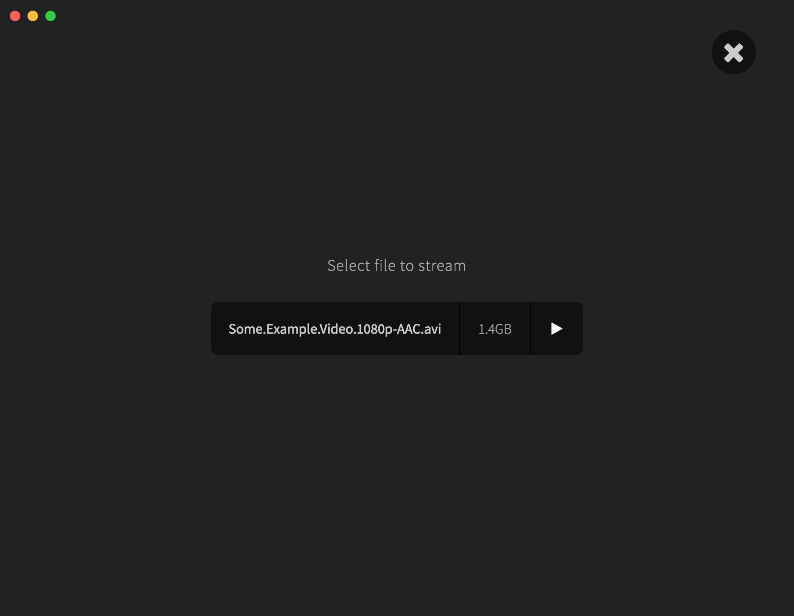
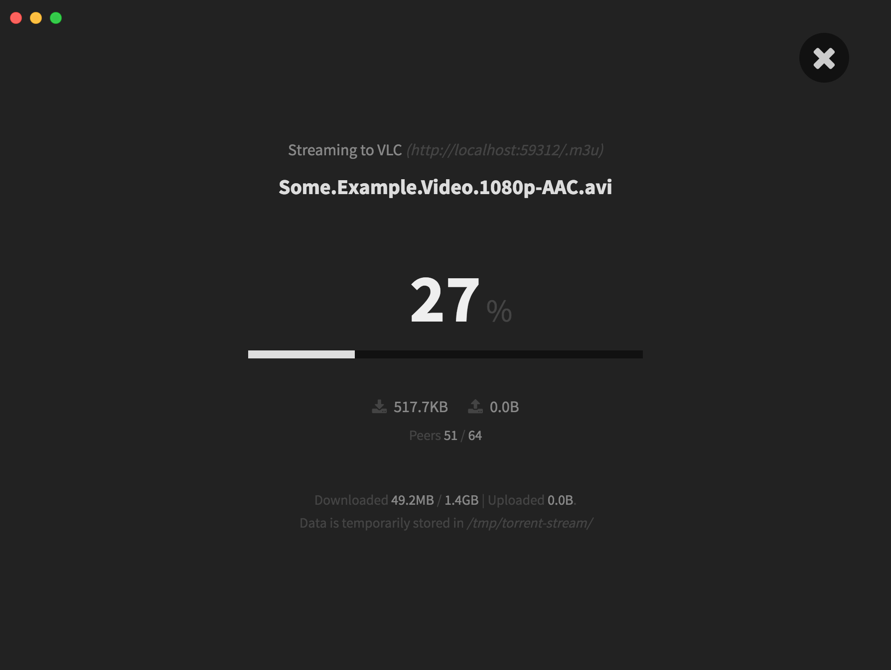

# superflix
<i>Interface for streaming torrents to VLC (VideoLAN Client) on Mac OS X</i>

Built with electron and reactjs using <a href="https://github.com/electron-userland/electron-forge">electron-forge</a>. Torrent streaming is handled by <a href="https://www.npmjs.com/package/torrent-stream-vlc">torrent-stream-vlc</a>.

## Prerequisites
- VLC for Max OS X (https://www.videolan.org/vlc/download-macosx.html)

## Download
You can download the latest version <a href="">here</a>.

## Development

    // clone the repo and cd into the directory
    git clone https://github.com/JanGunzenhauser/superflix && cd superflix

    // install dependencies (make sure to use node version > 6)
    npm install

    // start application (for development)
    npm start 

    // bundle .app file
    npm run package

    // bundle .dmg file
    npm run make

## Screenshots

